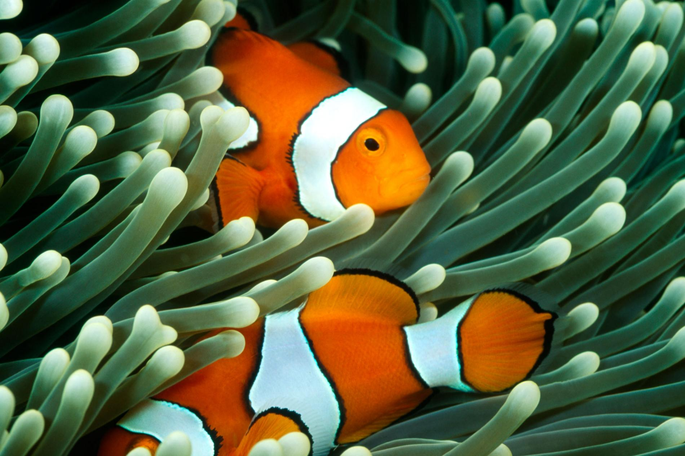

```{r setup, include=FALSE}
knitr::opts_chunk$set(echo = FALSE)
```




## Vocabulary 


|  Words from the text          |             Synonym/explanation in English 
|--------------------------------------- | --------------------------------------------------------------------------------------------------------------------------------------------------------------------------------------------------------------------------------------------------------------------------|
|climate change impacts       |       Climate-change impacts are the consequences of climate change – both expected and realised – for natural and human systems. Climate impacts research is typically interdisciplinary and frequently involves the construction of climate impact models                                                                                                                                                                                                                                                                                                                                                                                              |
|marine food webs             |   Marine food webs describe the linkages between all living organisms found in the marine environment                                |
|climate change               |        corresponds to a lasting modification of the parameters of the global climate of the Earth or its various regional climates                                                                                                                                                                                                                                                                                                                                       |
|biodiversity                 |      Biodiversity encompasses all living species on Earth, their relationship to one another, and the different genes, ecosystems and species                                                                                                                                                                                                                                                                                                                                                                       |
|The trophic level            |     corresponds to a situation in the food chain or ecological pyramid of an ecosystem, mesocosm, microcosm            |


## Analysis table 


|  recherchers                 |    Edited by James A. Estes, University of California, Santa Cruz, CA                                                                   |
|--------------------------------------- | -------------------------------------------------------------------------------------------------------------------------------------------------------------------------------------------------------------------------------------------------------------------------------------------------------------------------------------------------------------------------------------------------------------------------------------------------------------------------------------------------------------|
|Published in?               |   22/05/2019                                                                                                                                                                                                                                      |
|General topic               |  this article highlights the influence of climate change on oceanic ecosystems. in fact it shows that with the advent of climate change, there is a considerable decline in biomass in the oceans.                                                                                                                                                                                                                                                                                                         |
|Procedure/what was examined?|   Model Selection, Climate Change Scenarios,  Simulations, Analyses and Validation,  Data Accessibility, acknowledgment                                                                                                                                                                                                                                                                                                                                        |
|Conclusions/discovery?      |   the ensemble projections demonstrate that global ocean animal biomass consistently declines with climate change, and that impacts are amplified at higher trophic levels                                                                                                                                                                                                                     |
|Remaining questions?        |   there is not                |


