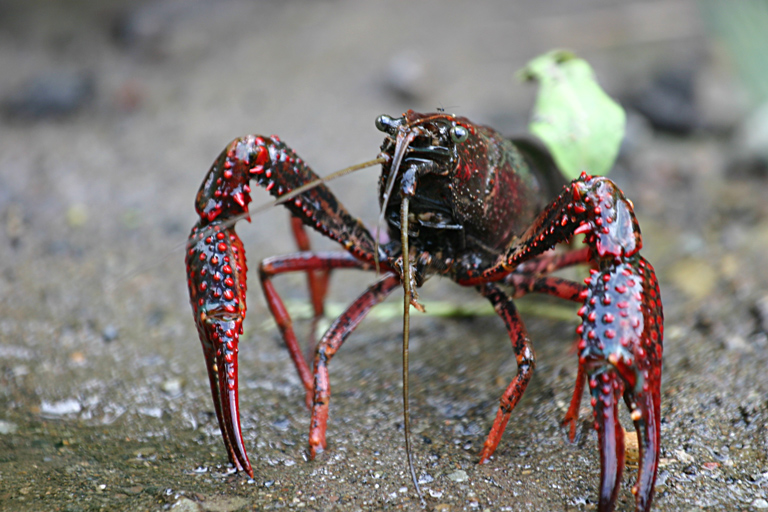

```{r setup, include=FALSE}
knitr::opts_chunk$set(echo = FALSE)
```



## vocabulary 

|  Words from the text   | synonym/explanation in english                                                                                                                                                      |
| ---------------------- | ----------------------------------------------------------------------------------------------------------------------------------------------------------------------------------- |
| admixture              |  assembly                                                                                                                                                                           |
| mitochondrial DNA      |  Mitochondrial DNA is a circular DNA molecule found in the mitochondria. This DNA molecule codes for part of the proteins and RNA specific to the functioning of the mitochondria.  |
| invasion hubs          | Mass arrival of animals or insect pests                                                                                                                                             |
| propagul pressur       | it is  structure for dissemination and reproduction                                                                                                                                 |
| biogeographic barriers |  adequacy                                                                                                                                                                           |
## Analyse table

| recherchers                                        | Francisco oficialdegui, Miguel clavero                                                                                                                                                                                                               |
| -------------------------------------------------- | ---------------------------------------------------------------------------------------------------------------------------------------------------------------------------------------------------------------------------------------------------- |
| Published in?                                      |  freshwater biology  may 2019                                                                                                                                                                                                                        |
|  General topic?                                    |  our global was to reconstruct dynamic of a global freshwater invader, the red swamp crayfish, precambrius clarkii, through the analysis of its genetic variability in both native and inversive range                                               |
| Procedure/what was examined?                       | Samplin, DNA extraction and sequencing, Genetic analyses                                                                                                                                                                                             |
| Conclusions/discovery?                             |   our finding highlight the value of genetic analyses to identify the geographic origine of source population as well as the variability of invaded areas in order to reconstruct invasion dynamic and facilitate managment of invasive species      |
|  Remaining questions                               | there are not                                                                                                                                                                                                                                        |
