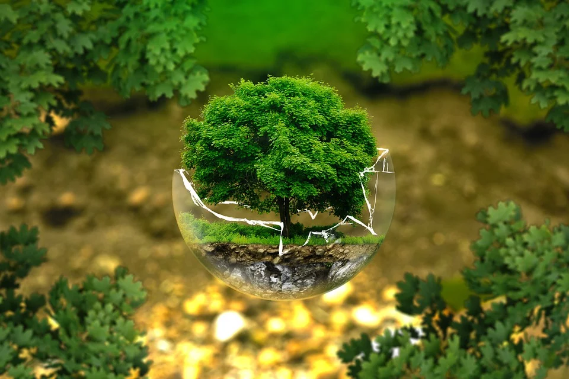

```{r setup, include=FALSE}
knitr::opts_chunk$set(echo = FALSE)
```



## Name of the magazine + source [URL] 

 encyclopedia of the environment https://www.encyclopedie-environnement.org/institutions/

## Vocabulary 
-------------------------------------------------------------------------------------------------------------------------------------------------------------------------------------------------------------------------------------------------------------------------------------

    Words from the text   Synonym/explanation in English                                                                                           ................................................................................................                                 
    lichens               symbiosis between mushroom and unicellular alga                                                                          
    atmospheric pollution is an alteration in air quality which can be characterized by measurements of chemical, biological or physical pollutants....
    ecology               Study of the environments in which living beings live, as well as the relationships of these beings with the environment
    physiology            Science that studies the functions and properties of organs and tissues in living things                                            
    anatomy               etude de la structure et de la forme des êtres organisés ainsi que des rapports entre leurs différents organes                                                                                                                                                                 
    bioindicator          groupement végétal dont la présence ou l'état renseigne sur certaines caractéristiques écologiques de l'environnement                         

## analyse table
---------------------------------------------------------------------------------------------------------------------------------------------------------------------------------------------------------------------------------------------------------------------------------------------------

    recherchers                    ASTA Juliette, Maître de Conférences Honoraire, Laboratoire de Botanique de l’Université Joseph Fourier puis LECA, UGA (Université Grenoble Alpes)                                                                                                                                              
    Published in?                  encyclopédie de l'environnement  28/11/2019                                                                                                                       
    general topics ?               lichen and environmental protection                                                                                                                    
     Procedure/what was examined?  field and laboratory studies(qualitative and quantitative methods) has shown that lichens are able to colonize any types of environment with lichenics substances                                                                                                                                                                                                         
     Conclusions/discovery?        lichens live in all environments except at sea. they live in symbiosis                                                                             
    Remaining questions                                                                                                                                                              
